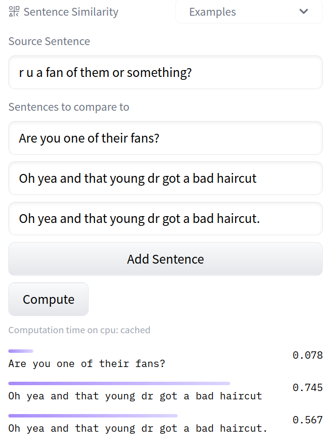

**TL;DR: PhD Candidate, Natural Language Processing, Language Variation and Diversity, Evaluating LLMs, Neural Style Representations, Paraphrasing in Dialog, Tokenization for Language Variation**

I am a PhD Candidate at the [NLP and Society Lab](https://nlpsoc.github.io/) at [Utrecht University](https://www.uu.nl/en) with [Dong Nguyen](https://dongnguyen.nl/). I study language variation (e.g., lexical variation, spelling variation, ... clustered around different social groups) via natural language processing (NLP) and machine learning methods. Previously, I studied computer science and mathematics at RWTH Aachen University. I also spent time at places like University of Michigan, Vrije Universiteit Amsterdam, UNSW Sydney and University of Auckland. Currently wrapping up my thesis with the working title "Say the Same but Differently: Measuring Stylistic Variation and Paraphrasing Across Speakers".

{: style=" float: middle; height: 150px; " .align-center}

Generally, I am interested in how to **evaluate**, **measure** and **represent** language variation. Questions I am interested in include: How to measure language variation in a dataset? How to curate training datasets including language diversity? How to evaluate representation of language variation in LLMs? How to represent language variation in LLMs? ...

---

{: style=" float: middle; height: 200px; " .align-center}

Check out our our style embedding model [on the huggingface model hub](https://huggingface.co/AnnaWegmann/Style-Embedding) (see also pic below). This is a model trained in [Content-Independent Style Representations](https://aclanthology.org/2022.repl4nlp-1.26/), see the video [here](https://www.youtube.com/watch?v=QHW7pfwJ56E). Evaluated on [STEL](https://github.com/nlpsoc/STEL). Consider contributing!

{: style=" float: middle; height: 500px; " .align-center}

Talks: SCALE at Johns Hopkins University (2022); Bocconi University (2021); Complexity Science Hub, Vienna (2020)

---

My PhD project is funded by [EMMA](https://www.emma.nl/) and [NWO](https://www.nwo.nl/en). This is a collaboration with Dong Nguyen (UU), [Kees van Deemter](https://www.uu.nl/staff/CJvanDeemter?t=0) (UU),  Tijs van den Broek and Bianca Beersma in the [#Bridging](https://nwo-bridging.github.io/) Project.

---

**Interested in doing a Bachelor's or Master's Thesis with me?** see: [Student Projects](https://annawegmann.github.io/student-projects/)

