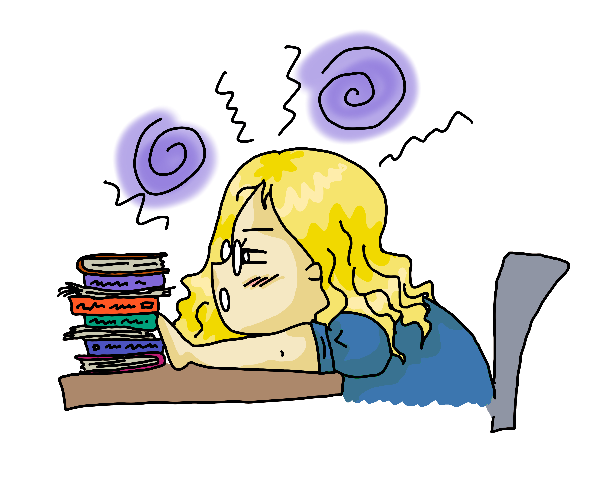
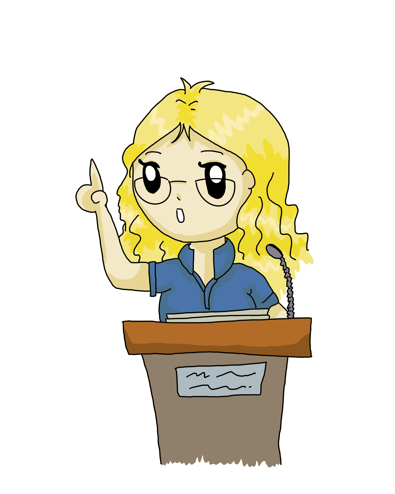

**TL;DR: PhD Candidate, Natural Language Processing, Computational Social Science, Language and Society, Language Variation, Facilitating Political Discourse, Looking for Internships!**

Hi, I am a PhD Candidate at the [NLP and Society Lab](https://nlpsoc.github.io/) at [Utrecht University](https://www.uu.nl/en) with [Dong Nguyen](https://dongnguyen.nl/). I study social phenomena via natural language processing (NLP) methods using (mostly) social media data. Previously, I completed my master's and bachelor's degree at RWTH Aachen University in computer science and mathematics  respectively.

{: style=" float: middle; height: 150px; " .align-center}

I am studying language variation (e.g., how people say something as opposed to what they say) and online discussions. Questions I am interested in include: Do people talk in a, to them, specific *style*? How does style or phrasing affect the course of a conversation? What are markers of a "good" conversation? Can we facilitate more constructive online discussions? And many more ...

Discourse topics I am especially interested in are those where the participating parties have conflicting interests. This can be topics like climate change, pensions or the corona virus.

---

{: style=" float: middle; height: 200px; " .align-center}

I presented our paper [Does It Capture STEL? A Modular, Similarity-based Linguistic Style Evaluation Framework](https://aclanthology.org/2021.emnlp-main.569/) at [EMNLP 2021](https://2021.emnlp.org/) (video [here](https://www.youtube.com/watch?v=WPbxyOrDK6w)). I presented our paper  ["Detecting Different Forms of Semantic Shift in Word Embeddings via Paradigmatic and Syntagmatic Association Changes"](https://annawegmann.github.io/pdf/Detecting-Different-Forms-of-Semantic-Shift.pdf) at the [International Semantic Web Conference 2020](https://iswc2020.semanticweb.org/) (video [here](https://www.youtube.com/watch?v=V8M8-8-TteA)).  

Invited Talks: Bocconi University (2021); Complexity Science Hub, Vienna (2020)

---

My PhD project is funded by [EMMA](https://www.emma.nl/) and [NWO](https://www.nwo.nl/en). This is (among others) a collaboration with Dong Nguyen (UU), [Kees van Deemter](https://www.uu.nl/staff/CJvanDeemter?t=0) (UU),  Tijs van den Broek and Bianca Beersma in the [#Bridging](https://nwo-bridging.github.io/) Project. 

---

**Interested in doing a Bachelor's or Master's Thesis with me?** see: [Student Projects](https://annawegmann.github.io/student-projects/)

