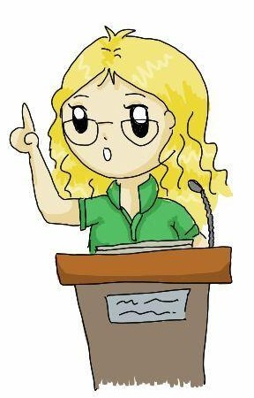

**TL;DR: PhD Candidate, Natural Language Processing, Computational Social Science, Language and Society, Language Variation, Facilitating Political Discourse, Looking for Internships for 2022!**

Hi, I am a PhD Candidate at the [NLP and Society Lab](https://nlpsoc.github.io/) at [Utrecht University](https://www.uu.nl/en) with [Dong Nguyen](https://dongnguyen.nl/). I study social phenomena via natural language processing (NLP) methods using (mostly) social media data. Previously, I completed my master's and bachelor's degree at RWTH Aachen University in computer science and mathematics  respectively.

{: style=" float: middle; height: 150px; " .align-center}

I am studying conversations. Questions I am interested in include: Do people talk in a, to them, specific *style*? How can style be measured? How does style or phrasing affect the course of a conversation? How does style correlate with "conversation quality"? What even is a good conversation? And many more ...

Discourse topics I am especially interested in are those where the participating parties have conflicting interests. This can be topics like climate change, pensions or the corona virus.

---

{: style=" float: middle; height: 150px; " .align-center}

I presented our paper [Does It Capture STEL? A Modular, Similarity-based Linguistic Style Evaluation Framework](https://aclanthology.org/2021.emnlp-main.569/) at [EMNLP 2021](https://2021.emnlp.org/) (video [here](https://www.youtube.com/watch?v=WPbxyOrDK6w)). I presented our paper  ["Detecting Different Forms of Semantic Shift in Word Embeddings via Paradigmatic and Syntagmatic Association Changes"](https://annawegmann.github.io/pdf/Detecting-Different-Forms-of-Semantic-Shift.pdf) at the [International Semantic Web Conference 2020](https://iswc2020.semanticweb.org/) ( video [here](https://www.youtube.com/watch?v=V8M8-8-TteA)).  

Invited Talks: Bocconi University (2021); Complexity Science Hub, Vienna (2020)

---

My PhD project is funded by [EMMA](https://www.emma.nl/) and [NWO](https://www.nwo.nl/en). This is a collaboration with Dong Nguyen (UU), [Kees van Deemter](https://www.uu.nl/staff/CJvanDeemter?t=0) (UU),  Tijs van den Broek and Bianca Beersma in the [#Bridging](https://nwo-bridging.github.io/) Project. 

---

**Interested in doing a Bachelor's or Master's Thesis with me?** 
Do you want to do a project in the fields of natural language processing (i.e., any program that uses 'natural language', e.g., English as input or output) and/or computational social sciences (i.e., social science questions that are tackled with modern computational approaches)? If you have topic suggestions that fit these general fields and should be manageable your given time frame, I am open to discuss those. If you are unsure if it could be a fit, drop me a mail. My personal research focus lies on language variation (e.g., how people say something as opposed to what they say) and online discussions. 

 Current topics I would find interesting to develop further with you are:  
 * **Style Evaluation** Do you want to expand on an existing NLP project? We recently published a paper (https://aclanthology.org/2021.emnlp-main.569/) on testing NLP models on whether are able to capture differences in how people express themselves (e.g., whether they use more formal or more informal words). We proposed a general framework to do this. However, the framework is far from finished. You could work on an existing project (https://github.com/nlpsoc/STEL) and add new style dimensions that state-of-the art style models can be tested on. Part of your thesis project would be motivating this new style dimension and collecting the necessary data to test models on it. Your contribution could even be part of a future publication on expanding the framework. Possible new style dimensions include: + Are people using the active or passive voice ("The cashier counted the money." vs. "The money was counted by the cashier.", see also: https://www.grammarly.com/blog/active-vs-passive-voice/) + How are people using punctuation? E.g., are they using punctuation at all? When are exclamation marks used? When are people repeating the same punctuation mark? + How are people  casing their words? Are people starting the sentence with an upper case letter or not? Are they writing "i" or "I"? Does it depend on the context?  
 * **Language Variation in Context** Maybe you do not want to meddle with an existing project but are still interested in language variation and how people use different ways to express themselves? You could take a look at a very specific style dimension that people use (same dimensions possible as before: e.g., active vs. passive voice, punctuation usage, ...) and when/how online communities use them. You would develop a method to detect whether people use a specific style feature or not (e.g., active vs. passive voice) and then quantitatively analyze how people use these features/ what the effect of using the style features are. For example, see [How Active, Passive and Nominal Styles Affect Redability of Science Writing](https://sci-hub.se/https://doi.org/10.1177%2F107769908306000408)  
 * **Style Change Detection Task** Did you always want to take part in a leaderboard competition? You can make it your thesis project. For example, you could participate in the Style Change Detection Task for 2022. (2021, see here: https://pan.webis.de/clef21/pan21-web/index.html). The submission is probably somewhere in April for this year. In case that does not work together with your starting date, you might not be able to formally submit for this year, but you can still test your model and compare it to other people's work or submit it a year later. The Style Change Detection Task is about detecting whether and where the author of a text changes. These kinds of tasks are often also known as authorship attribution. You could try out different methods from that field (e.g., LIWC, character n-grams, ...) and train some classification methods (e.g., logistic regression). Related Keywords: Authorship Verification, Authorship Attribution, Style Measurement  
 * **Generation Detection** Do you sometimes read a text and just know it has been written by an unhappy teenager? Or a disgruntled grandmother? You could work on an algorithm that learns to predict generational identity (e.g., [Exploring Generational Identity: A Multiparadigm Approach](http://t.www.na-businesspress.com/JBD/UrickMJ_Web12_3_.pdf)) from a social media post. This could be interesting to later (e.g., on a platform like Reddit) see how the average Boomer argues about climate change in comparison to the average Millenial. There has been some work in predicting age from short texts (e.g., [Why Gender and Age Prediction from Tweets is Hard: Lessons from a Crowdsourcing Experiment](https://aclanthology.org/C14-1184.pdf), [Age Groups Classification in Social Network Using Deep Learning](https://ieeexplore.ieee.org/document/7932459)). You could use those as a (first) approximation of generational identity?
 * Deliberation or more general conversation quality (see, e.g., [Conversations gone awry](https://www.aclweb.org/anthology/P18-1125/))  -- Questions could include "Is there something like converstional flow?", "What makes a political discourse successful?" 
    * Intimacy (e.g., see [Quantifiying Intimacy in Language](https://www.aclweb.org/anthology/2020.emnlp-main.428/)) -- Questions could include "Does intimacy improve a conversation?", "In which conversation do people show intimacy?"  
    * Empathy (see, e.g., [Modeling Empathy and Distress in Reaction to News Stories](https://aclanthology.org/D18-1507/)  -- e.g., "How can we measure empathy?", "What is the effect of increased empathy in a conversation?"
    * Linguistic Accommodation (e.g., [Mark my words!: linguistic style accommodation in social media](https://doi.org/10.1145/1963405.1963509))
 * Conflict conversations -- Detection, Resolving, Strategies (e.g., see [Conversational Receptiveness](https://doi.org/10.1016/j.obhdp.2020.03.011))
 * Generation Detection -- e.g., is a text author a boomer, zoomer or millenial?
 * Intrinsic plagiarism detection (see, e.g. [Is writing style predicitve of scientific fraud?](https://www.aclweb.org/anthology/W17-4905/)) -- Topics could be about improving detection algorithms, finding features relating to fraud, finding areas that are especially susceptible to fraud, ...  
 * Gender Bias in Fiction (e.g., [Analyzing Gender Bias within Narrative Tropes](https://www.aclweb.org/anthology/2020.nlpcss-1.23.pdf)) -- How does popular culture influence popular belief?

