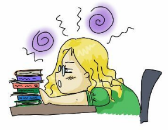

**TL;DR: PhD Candidate, Natural Language Processing, Computational Social Science, Language and Society, Language Variation, Facilitating Political Discourse, Looking for Internships for 2022!**

Hi, I am a PhD Candidate at the [NLP and Society Lab](https://nlpsoc.github.io/) at [Utrecht University](https://www.uu.nl/en) with [Dong Nguyen](https://dongnguyen.nl/). I study social phenomena via natural language processing (NLP) methods using (mostly) social media data. Previously, I completed my master's and bachelor's degree at RWTH Aachen University in computer science and mathematics  respectively.

{: style=" float: middle; height: 150px; " .align-center}

I am studying conversations. Questions I am interested in include: Do people talk in a, to them, specific *style*? How can style be measured? How does style or phrasing affect the course of a conversation? How does style correlate with "conversation quality"? What even is a good conversation? And many more ...

Discourse topics I am especially interested in are those where the participating parties have conflicting interests. This can be topics like climate change, pensions or the corona virus.

**Interested in doing a Bachelor's or Master's Thesis with me?** 
Do you want to do a bachelor's or master's project in the fields of natural language processing (i.e., any program that uses 'natural language', e.g., English as input or output) and computational social sciences (i.e., social science questions that are tackled with modern computational approaches)? 

My personal research focus lies on language variation (e.g., how people say something as opposed to what they say) and online discussions. If you have topic suggestions that fit this general field and should be manageable in 10 weeks, I am open to discuss those. If you are unsure if it could be a fit, drop me a mail. 

 Current topics I would find interesting to develop further with you are:  
 * Conversation quality (see, e.g., [Conversations gone awry](https://www.aclweb.org/anthology/P18-1125/))  -- Questions could include "Is there something like converstional flow?", "What makes a political discourse successful?" 
    * Intimacy (e.g., see [Quantifiying Intimacy in Language](https://www.aclweb.org/anthology/2020.emnlp-main.428/)) -- Questions could include "Does intimacy improve a conversation?", "In which conversation do people show intimacy?"  
    * Empathy (see, e.g., [Modeling Empathy and Distress in Reaction to News Stories](https://aclanthology.org/D18-1507/)  -- e.g., "How can we measure empathy?", "What is the effect of increased empathy in a conversation?"
    * Linguistic Accommodation (e.g., [Mark my words!: linguistic style accommodation in social media](https://doi.org/10.1145/1963405.1963509))
 * Conflict conversations -- Detection, Resolving, Strategies (e.g., see [Conversational Receptiveness](https://doi.org/10.1016/j.obhdp.2020.03.011))
 * Generation Detection -- e.g., is a text author a boomer, zoomer or millenial?
 * Intrinsic plagiarism detection (see, e.g. [Is writing style predicitve of scientific fraud?](https://www.aclweb.org/anthology/W17-4905/)) -- Topics could be about improving detection algorithms, finding features relating to fraud, finding areas that are especially susceptible to fraud, ...  
 * Gender Bias in Fiction (e.g., [Analyzing Gender Bias within Narrative Tropes](https://www.aclweb.org/anthology/2020.nlpcss-1.23.pdf)) -- How does popular culture influence popular belief?

---

{: style=" float: middle; height: 150px; " .align-center}

I presented our paper [Does It Capture STEL? A Modular, Similarity-based Linguistic Style Evaluation Framework](https://aclanthology.org/2021.emnlp-main.569/) at [EMNLP 2021](https://2021.emnlp.org/) (video [here](https://www.youtube.com/watch?v=WPbxyOrDK6w)). I presented our paper  ["Detecting Different Forms of Semantic Shift in Word Embeddings via Paradigmatic and Syntagmatic Association Changes"](https://annawegmann.github.io/pdf/Detecting-Different-Forms-of-Semantic-Shift.pdf) at the [International Semantic Web Conference 2020](https://iswc2020.semanticweb.org/) ( video [here](https://www.youtube.com/watch?v=V8M8-8-TteA)).  

Invited Talks: Bocconi University (2021); Complexity Science Hub, Vienna (2020)

---
My PhD project is funded by [EMMA](https://www.emma.nl/) and [NWO](https://www.nwo.nl/en). This is a collaboration with Dong Nguyen (UU), [Kees van Deemter](https://www.uu.nl/staff/CJvanDeemter?t=0) (UU),  Tijs van den Broek and Bianca Beersma in the [#Bridging](https://nwo-bridging.github.io/) Project. 
